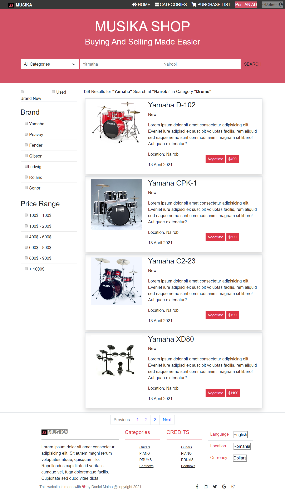

<h2><b>Music-Instruments Store</b></h2>

The assignment is to build a e-commerce website with homepage and search result page.

 

The general purpose of the project was to practice use of Flexbox and capacity to build a responsive website.
 
<h3><b>Built with</b></h3>

<ul>
  <li>HTML & CSS</li> 
  <li>Technologies include CSS flexbox </li>
  <li>Build using bootstrap framework </li>
</ul>
 
<h3><b>Live Demo</b></h3>

<a href="https://danmainah.github.io/music-instruments-store/">Live Demo Link</a> 

<h3><b>Getting Started</b></h3>

To get a local copy up and running follow these simple example steps.

Go to https://github.com/danmainah/music-instruments-store

1. Clone the project from the repo.
2. Navigate to the project.
3. You can run the project by either using a local server e.g using VSCODE's live server or by clicking directly onto the index.html file to open in your browser.                  
                                                       
<h3><b>Author</b></h3>

 

 👤 Author 
   
<ul>
  <li>GitHub: <a href="https://github.com/danmainah">Dan Mainah</a></li>
  <li>Twitter: <a href="https://twitter.com/dan_mainah">Dan Mainah</a></li>
  <li>LinkedIn: <a href="www.linkedin.com/in/daniel-maina-315a38191">Daniel Maina</a></li>
</ul   

<h3><b>Show your support</b></h3>
Give a ⭐️ if you like this project!

<h3><b>Acknowledgments</b></h3>

Thanks to Mohammed Anwar of [Behance](https://www.behance.net/gallery/24796463/ZATTIX) for the amazing website design that this project is based on.
To my Stand Up Team who kept my morale up!
